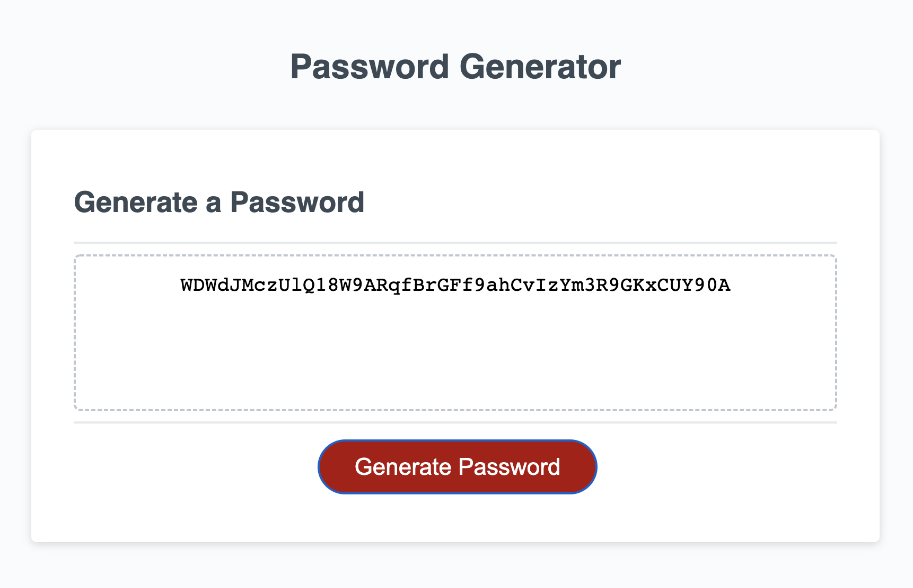

## Description

This website generates a random, unique password for the user based on critera the user has determined.  When the button is clicked, window prompts direct the user to select which characters they would like to include in their password.  Through randomization, the user will be presented with a password including characters they have approved, as well as being a legnth they have chosen.

## GitHub Repo
https://abbyrosenthal.github.io/password-generatorAR/

## Screenshot of Website
